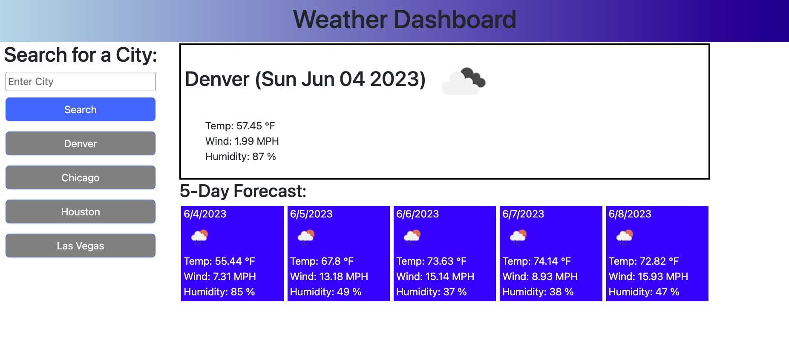

# Weather Dashboard

## Description

The weather dashboard provides a place for users to enter any city into the search query and it respond with live updated weather data of current weather as well as the five day forecast. It also keeps a list of previous searches with local storage and provides a quick tap button to reload a previously searched city. 

## Installation 

N/A

## Usage

Deployed URL:

## Credits

weather data provided by Open Weather Api

https://openweathermap.org/

